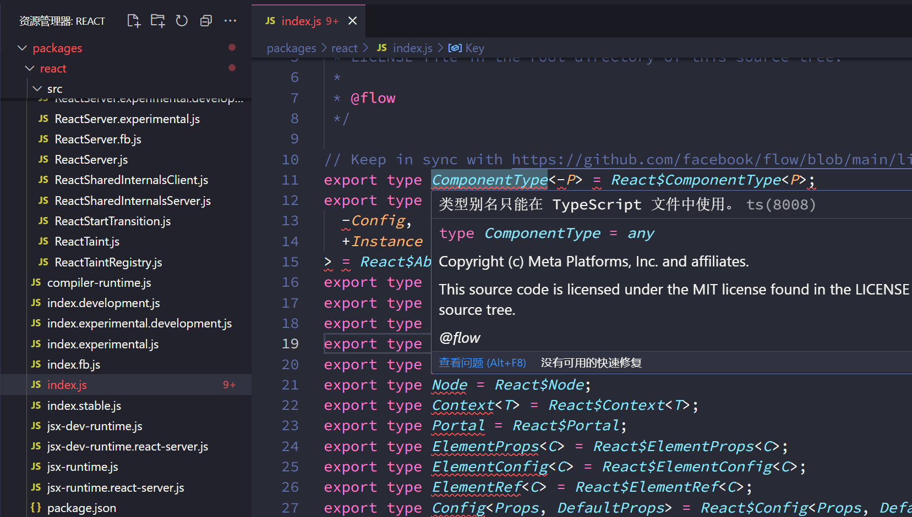
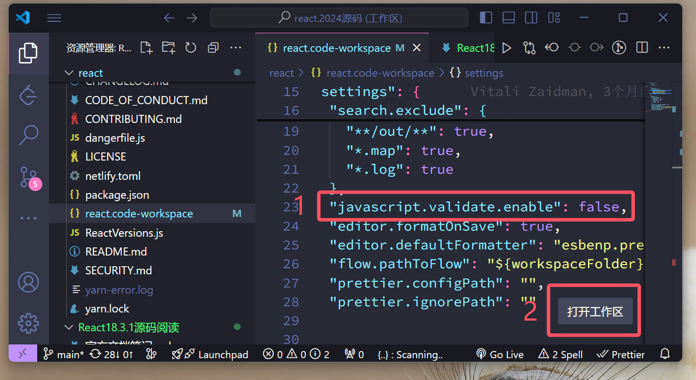
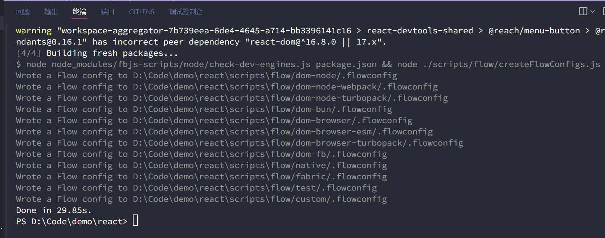

当前使用的版本为 React18.3.1, 时间为 2024-09-07.

## 打开文件即报错

打开react源码，随意打开packages下任意文件，会发现TS报错

阅读报错信息后会惊讶的发现React源码竟然将TS类型写在了js后缀文件中



这是由于【React使用flow进行类型检测】

### 第一步，取消报错

修改VSCode 文件/首选项/设置，关闭默认的ts对js文件的类型检测 `javascript.validate.enable": false`

但又不想因此影响我使用VSCode查看其他TS项目，可以使用`.code-workspace`文件对VSCode设置进行项目级定义,

随后发现React源码中已有`react.code-workspace`



打开再次发现，已经有此配置(见1)，为何没生效呢?

原来是我们没按工作区打开，请点击打开工作区(见2)，TS报错消失。

### 第二步，启用flow对TS的类型检查

安装VSCode插件, Flow Language Support, 安装后可能需要重启VSCode


再去看packages下的文件，TS类型支持已出现。

## yarn install 报错

### 连接不上 raw.githubusercontent.com

```text
‼ getaddrinfo ENOENT raw.githubusercontent.com
  ‼ gifsicle pre-build test failed
  i compiling from source
  × Error: Command failed: C:\WINDOWS\system32\cmd.exe /s /c "autoreconf -ivf"
```

可以看到根本原因是无法连接到网站 `raw.githubusercontent.com`

打开位于 `C:\Windows\System32\drivers\etc` 下的host文件

添加 `199.232.28.133 raw.githubusercontent.com` 保存, 再次运行`yarn install`



当然, 更建议每位程序员都有自己的上网工具,

Google,Stack Overflow,GPT4.0,都是常备开发利器,GitHub也会根据时节不同被墙。

## 如何调试

## 从哪开始
